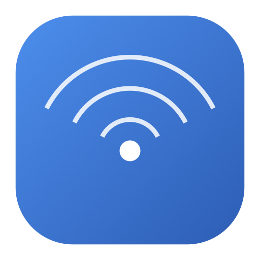

<div align="center">
  
  <h1>LANScan</h1>
  <p>Wer ist in meinem Netzwerk? Alle Geräte im WLAN/LAN auf einen Blick – nativ für macOS.</p>
  <p>
    <a href="https://github.com/Kalyro98/LANScan/releases/latest/download/LANScan.dmg"><b>⬇️ LANScan herunterladen (DMG)</b></a>
    &nbsp;·&nbsp;
    <a href="https://github.com/Kalyro98/LANScan/releases/latest">Alle Releases</a>
  </p>
</div>

---

**LANScan** scannt das aktuell verbundene Netzwerk und listet alle gefundenen Geräte mit
**Name, IP-Adresse, MAC-Adresse und Hersteller** auf. Geräte lassen sich umbenennen und mit
Symbolen versehen – die Namen bleiben dauerhaft gespeichert, auch wenn sich die IP per DHCP
ändert. Ideal, um den Überblick im Heimnetz zu behalten und unbekannte Geräte zu entdecken.

## Funktionen
- 🔍 **Schneller Scan** des eigenen Subnetzes (Ping-Sweep + ARP) mit Live-Fortschritt.
- 🏷️ **Geräte umbenennen** (Doppelklick, Stift oder Kontextmenü) – Namen sind an die MAC
  gebunden und überleben IP-Wechsel und Neustarts.
- 🎨 **Gerätesymbole** (Router, NAS, Smartphone, Drucker, …) werden automatisch aus Hostname
  und Hersteller erraten und sind manuell überschreibbar.
- 🏭 **Hersteller-Erkennung** über die IEEE/Wireshark-OUI-Datenbank (~57'000 Einträge),
  aktualisiert sich automatisch im Hintergrund (max. 1×/Tag, offline-sicher).
- 📡 **Bonjour/mDNS-Erkennung**: Geräte ohne DNS-Namen werden über ihre annoncierten
  Dienste (AirPlay, HomeKit, Drucker, …) erkannt und benannt.
- 💾 **Persistente Geräteliste**: Bekannte Geräte erscheinen sofort nach dem Start –
  Offline-Geräte grau mit „zuletzt gesehen vor X“.
- 🔄 **Auto-Scan** im Intervall (1–30 min) mit **Benachrichtigung, wenn ein neues,
  unbekanntes Gerät im Netz auftaucht**.
- 🌐 **„Im Browser öffnen“** für Geräte mit Web-Oberfläche (automatisch erkannt).
- ⏰ **Wake-on-LAN**: Geräte per Rechtsklick aufwecken (Magic Packet).
- ↕️ **Sortierbare Spalten**, Suche und „nur unbenannte“-Filter; IP/MAC kopieren per Rechtsklick.
- 🔒 Läuft **komplett lokal** – keine Cloud, keine Telemetrie; gespeichert wird nur in
  `~/Library/Application Support/LANScan/`.

## Voraussetzungen
- macOS 14.0 oder neuer
- Zum Selbst-Bauen: Xcode Command Line Tools (Swift 5.9+) – kein Xcode-Projekt nötig

## Installation
1. Das [`LANScan.dmg`](https://github.com/Kalyro98/LANScan/releases/latest/download/LANScan.dmg) laden (immer die neueste Version).
2. DMG öffnen und **LANScan** in den **Programme**-Ordner ziehen.
3. Beim ersten Start (App ist nicht signiert): **Rechtsklick auf LANScan → „Öffnen“** und im
   Dialog bestätigen. Danach startet sie normal.
4. Beim ersten Scan fragt macOS nach der Berechtigung für das **lokale Netzwerk** – zulassen.

## Wie es funktioniert
1. **Ping-Sweep** über alle Adressen des eigenen Subnetzes füllt den ARP-Cache des Systems
   (sehr große Netze werden aufs eigene /24 begrenzt).
2. Die **ARP-Tabelle** liefert die IP↔MAC-Zuordnung aller antwortenden Geräte.
3. **Reverse-DNS/mDNS** und **Bonjour-Browsing** lösen die Gerätenamen auf; parallel wird
   geprüft, welche Geräte eine **Web-Oberfläche** (Port 80/443) anbieten.
4. Die **MAC-Präfixe** werden gegen die Wireshark-OUI-Datenbank aufgelöst (MA-L/M/S,
   längste Übereinstimmung). Zufalls-MACs (iPhone & Co.) werden als „Private Adresse“ erkannt.

## Selbst bauen
```bash
git clone https://github.com/Kalyro98/LANScan.git
cd LANScan
./build.sh        # Release-Build → dist/LANScan.app + dist/LANScan-<version>.dmg
```
Für schnelle Debug-Builds genügt `swift build`.

## Hinweise
- Die App ist **nicht sandboxed** (sie ruft `ping`/`arp` auf) und **ad-hoc signiert** –
  daher der Rechtsklick-Trick beim ersten Start.
- Wake-on-LAN funktioniert nur bei Geräten mit aktiviertem WoL (BIOS/UEFI) und in der Regel
  nur über **Ethernet**.
- Benachrichtigungen für neue Geräte erscheinen erst, nachdem der Auto-Scan einmal aktiviert
  und die Berechtigung erteilt wurde.

## Lizenz
[MIT](LICENSE) – © 2026 Dino
